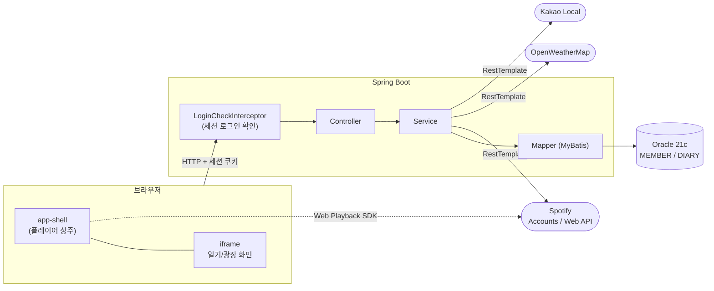
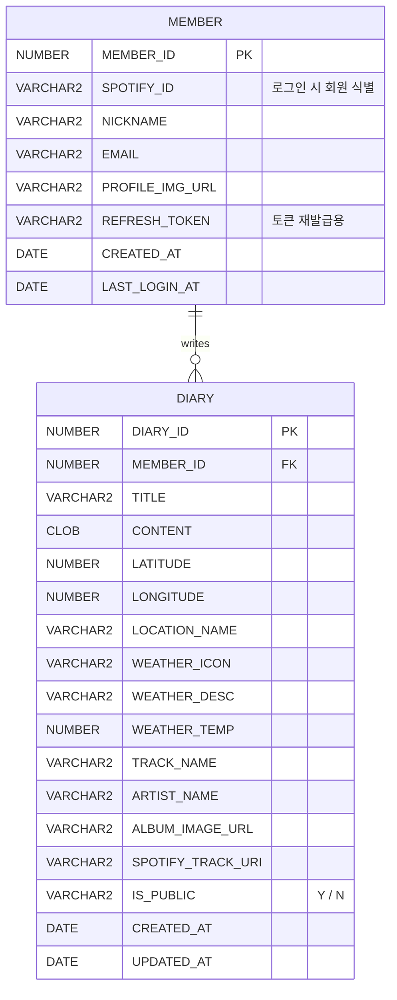
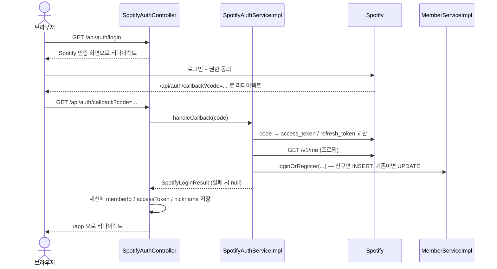

# 🎵 Sound Diary (감성 음악 일기장)

> **"오늘의 날씨, 그 순간 머문 장소, 그리고 귓가를 맴돌던 노래를 한 페이지에."**
> 위치(GPS)와 실시간 날씨, 그리고 Spotify 음악을 함께 기록하는 감성 일기 웹 애플리케이션입니다.

<br>

<p align="center">
  
  
  
  
  
</p>

---

## 📌 1. Project Overview

* **진행 기간:** 2026.09.14 - 09.29 (2주)
* **개발 인원:** 1인 (개인 프로젝트)
* **주요 목표:**
  * Spotify 계정으로 로그인하고, 일기에 곡을 붙여 그 자리에서 전곡 재생
  * 작성 시점의 위치(동 이름)와 날씨를 자동으로 함께 기록
  * 공개 일기를 모아 보는 감성 광장과 오늘의 인기곡 랭킹 제공
  * Controller–Service–Mapper 계층을 지키고, 제네릭과 DTO로 타입 안정성 확보

---

## 🛠 2. Tech Stack

| 분류 | 기술 스택 | 상세 설명 |
| :--- | :--- | :--- |
| **Language** | Java 17 | LTS 버전 |
| **Framework** | Spring Boot 2.7.18 | Spring 5.3.x, javax 호환 유지 |
| **Data Access** | MyBatis 2.3.2, HikariCP | SQL 매퍼, 커넥션 풀 |
| **Database** | Oracle Database 21c XE | XEPDB1 플러그형 DB |
| **DB Driver** | OJDBC8 | |
| **인증** | Spotify OAuth 2.0 (Authorization Code) + HttpSession | 자체 비밀번호 없이 Spotify에 로그인 위임 |
| **External API** | Spotify Web API, Spotify Web Playback SDK | 곡 검색·추천, 브라우저 전곡 재생 |
| | OpenWeatherMap API | 현재 날씨 |
| | Kakao Local API | 위도/경도 → 동 이름 변환 |
| **Frontend** | Thymeleaf, Vanilla JS, Bootstrap 5.3 | |
| **Build & Tool** | Maven, Lombok, STS4, Git / GitHub | |

---

## ✨ 3. 주요 기능

| 기능 | 내용 |
| :--- | :--- |
| **Spotify 로그인** | OAuth 로그인 → 회원 자동 가입/갱신 → 세션으로 로그인 유지. 토큰이 만료되면 refresh_token으로 자동 재발급 |
| **일기 작성/조회/수정/삭제** | 제목·내용·곡·위치·날씨·공개 여부 저장. 페이징 목록. 수정/삭제는 본인 글만 가능 |
| **감성 광장** | 공개 일기 목록과 상세 보기. 남의 비공개 글은 볼 수 없음 |
| **오늘의 인기곡** | 오늘 공개 일기에 가장 많이 붙은 곡 Top 5 |
| **음악 재생** | Web Playback SDK로 전곡 재생. 곡이 끝나면 같은 아티스트의 다른 곡을 자동 재생 |
| **날씨/위치** | 브라우저 위치로 현재 날씨와 동 이름을 조회해 헤더에 표시하고 일기에 기록 |

> ⚠️ Web Playback SDK는 **Spotify Premium 계정**에서만 재생됩니다.

---

## 🏛 4. System Architecture



`app-shell`이 하단 플레이어를 갖고 있고, 각 화면은 그 안의 iframe에서 바뀝니다. 그래서 페이지를 이동해도 음악이 끊기지 않습니다.

### 패키지 구조

```text
com.sj.sound_diary
├── config       WebMvcConfig(인터셉터 등록), LoginCheckInterceptor, RestTemplateConfig
├── controller   SpotifyAuth / Spotify / Diary / DiaryForm / Community / Weather / View
├── service      인터페이스 6개 (SpotifyAuth, Spotify, Member, Diary, Weather, Location)
│   └── impl     구현체 — 비즈니스 로직과 외부 API 호출
├── mapper       DiaryMapper, MemberMapper  (+ resources/mapper/*.xml)
├── dto          DiaryDto, MemberDto, TrackDto, TrackRankingDto, WeatherDto,
│                SpotifyTokenResponseDto, SpotifyProfileDto, SpotifyLoginResult
└── util         SessionUtils, RestTemplateUtils, JsonUtils (제네릭 공통 유틸)
```

### ERD



---

## 🔐 5. 핵심 흐름: Spotify 로그인



* 로그인 이후에는 세션 쿠키만으로 인증을 유지합니다. `/api/auth/**`와 정적 리소스를 뺀 모든 요청은 `LoginCheckInterceptor`가 세션의 `memberId`를 먼저 확인합니다.
* Spotify API가 401(토큰 만료)을 돌려주면, DB의 refresh_token으로 access_token을 새로 받아 세션을 갱신하고 같은 요청을 한 번 더 보냅니다.

---

## 🧩 6. 설계 포인트

**컨트롤러는 얇게, 비즈니스 로직은 서비스에**
로그인 콜백의 "토큰 교환 → 프로필 조회 → 회원 저장" 흐름을 컨트롤러에서 `SpotifyAuthService.handleCallback()`으로 옮겼습니다. 컨트롤러는 결과를 세션에 담고 어디로 보낼지만 정합니다.

**제네릭으로 타입별 중복 캐스팅 제거**
| 유틸 | 없애는 중복 |
| :--- | :--- |
| `SessionUtils.attr<T>(session, key)` | `(Long) session.getAttribute("memberId")` 같은 세션 캐스팅 |
| `RestTemplateUtils.get<T>() / post<T>()` | `exchange(...).getBody()`, `postForObject(...)` 호출 보일러플레이트 |
| `JsonUtils.field<T>(map, key)` | `(String) map.get("name")` 같은 JSON Map 캐스팅 |

**Map 대신 DTO**
응답 구조가 정해진 곳은 `Map<String, Object>` 대신 DTO로 받습니다.
* `TrackRankingDto` — 인기곡 랭킹 (MyBatis `resultType`)
* `SpotifyTokenResponseDto`, `SpotifyProfileDto` — Spotify 인증 응답 (Jackson 역직렬화)

**본인 확인**
* 수정/삭제: SQL에 `WHERE DIARY_ID = ? AND MEMBER_ID = ?` 조건을 걸어, 남의 글이면 0건 처리 → 수정은 목록으로 리다이렉트, 삭제는 403
* 상세 보기: 서비스에서 "본인 글이거나 공개 글"일 때만 돌려주고, 아니면 목록으로 리다이렉트
* 수정 시 `memberId`는 폼 값이 아니라 세션 값으로 덮어씀

---

## 🚀 7. 실행 방법

1. Oracle 21c XE에 `MEMBER`, `DIARY` 테이블을 만들고 `application.properties`의 datasource를 맞춥니다.
2. `src/main/resources/application-secret.properties`를 만듭니다. 이 파일은 `.gitignore`에 등록되어 있어 커밋되지 않습니다.

   ```properties
   spotify.client-id=발급받은_클라이언트_ID
   spotify.client-secret=발급받은_클라이언트_시크릿
   spotify.redirect-uri=http://localhost:8080/api/auth/callback
   openweather.api-key=OpenWeatherMap_API_키
   kakao.rest-api-key=카카오_REST_API_키
   ```
3. Spotify Developer Dashboard에 위 `redirect-uri`를 등록합니다.
4. 실행 후 `http://localhost:8080/app` 에 접속합니다.

---

## 📝 8. 개선 예정

* refresh_token 암호화 저장
* 세션 쿠키 `Secure` / `SameSite` 옵션 명시, CSRF 방어
* `SpotifyServiceImpl`, `LocationServiceImpl`의 응답 파싱도 DTO로 전환해 파싱 방식 통일
